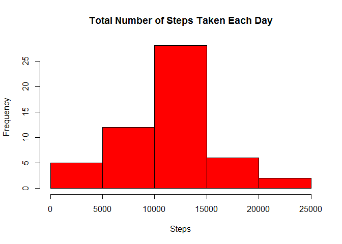
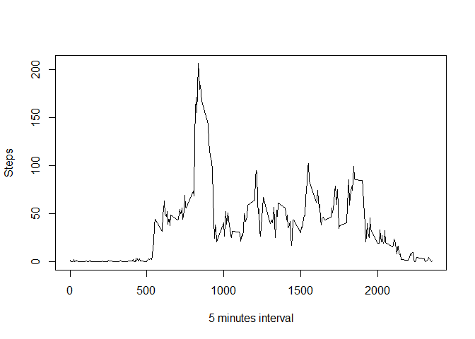
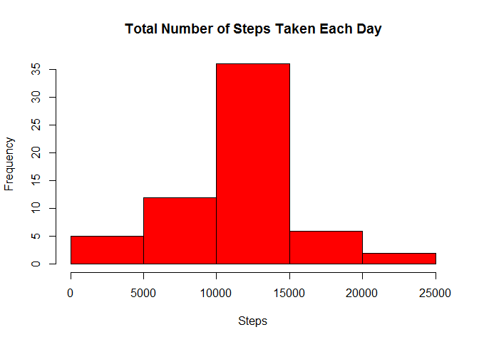
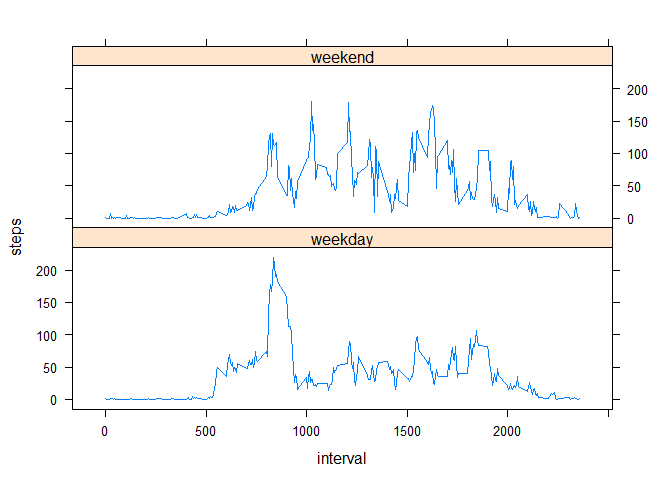

# Reproducible Research: Peer Assessment 1


## Loading and preprocessing the data


```r
library(data.table)
dt<- data.table(read.csv(unz("activity.zip", "activity.csv"), header=T, sep=",", colClasses = c("numeric", "Date", "numeric")))
```

## What is mean total number of steps taken per day?
1. Histogram of the total number of steps taken each day. Ignoring missing values.

```r
dt1<-dt[,lapply(.SD,sum),by="date",.SDcols=1]
hist(dt1$steps, 
     main= "Total Number of Steps Taken Each Day", 
     col="red", 
     xlab="Steps")
```

 
2. Calculate and report the **mean** and **median** total number of steps taken per day

```r
mean(dt1$steps, na.rm=T)
```

```
## [1] 10766.19
```

```r
median(dt1$steps, na.rm=T)
```

```
## [1] 10765
```
## What is the average daily activity pattern?
1. Makes a time series plot (i.e. `type = "l"`) of the 5-minute interval (x-axis) and the average 
number of steps taken, averaged across all days (y-axis).

```r
dt.NAomit<-na.omit(dt)
dt2<- dt.NAomit[,lapply(.SD,mean), by="interval",.SDcols=1]
plot(dt2$interval, dt2$steps, 
     type = "l",
     xlab = "5 minutes interval",
     ylab = "Steps")
```

 
2. Presents the 5-minute interval which, on average across all the days in the dataset, contains the maximum number of steps.

```r
subset(dt2, steps==max(dt2$steps))
```

```
##    interval    steps
## 1:      835 206.1698
```


## Imputing missing values

1. Calculates and reports the total number of missing values in the dataset (i.e. the total number of rows with `NA`s)

```r
nrow(dt)-nrow(dt.NAomit)
```

```
## [1] 2304
```
2. Fills in all of the missing values in the dt with the **mean** for that interval. Creates a new dataset called dt3 that is equal to the original dataset but with the missing data filled in.


```r
#split data table in 2, NA's to one table and good values to another.
split<-split(dt, is.na(dt$steps))
#creates vector which gives the respective step average for each interval
bu<-sapply(split[[2]]$interval, function (x) (dt2[dt2$interval==x]$steps))
#replaces NA's for the respective interval averages
split[[2]]$steps<-bu
#creates new data set by putting back together the "corrected" subset of Na's and the "good" #values.
dt3<-unsplit(split,is.na(dt$steps))
```
4. Make a histogram of the total number of steps taken each day and Calculate and report the **mean** and **median** total number of steps taken per day. Do these values differ from the estimates from the first part of the assignment? What is the impact of imputing missing data on the estimates of the total daily number of steps?

```r
dthist3<-dt3[,lapply(.SD,sum),by="date",.SDcols=1]
hist(dthist3$steps, 
     main= "Total Number of Steps Taken Each Day", 
     col="red", 
     xlab="Steps")
```

 

```r
mean(dthist3$steps)
```

```
## [1] 10766.19
```

```r
median(dthist3$steps)
```

```
## [1] 10766.19
```
The histograms are slightly different. By replacing NA's with the interval averages we make the new histogram more concentrated towards its mean (the new q1 and q3 are closer to the mean)

```r
summary(dt1)
```

```
##       date                steps      
##  Min.   :2012-10-01   Min.   :   41  
##  1st Qu.:2012-10-16   1st Qu.: 8841  
##  Median :2012-10-31   Median :10765  
##  Mean   :2012-10-31   Mean   :10766  
##  3rd Qu.:2012-11-15   3rd Qu.:13294  
##  Max.   :2012-11-30   Max.   :21194  
##                       NA's   :8
```

```r
summary(dthist3)
```

```
##       date                steps      
##  Min.   :2012-10-01   Min.   :   41  
##  1st Qu.:2012-10-16   1st Qu.: 9819  
##  Median :2012-10-31   Median :10766  
##  Mean   :2012-10-31   Mean   :10766  
##  3rd Qu.:2012-11-15   3rd Qu.:12811  
##  Max.   :2012-11-30   Max.   :21194
```
## Are there differences in activity patterns between weekdays and weekends?

```r
Sys.setlocale("LC_TIME", "C")
```

```
## [1] "C"
```

```r
weekdays<-sapply(dt3$date,weekdays)
dt4weekday<-cbind(dt3,weekdays)
dt4weekday$weektype<- as.factor(ifelse(dt4weekday$weekdays %in% c("Satuday", "Sunday"), 
    "weekend", "weekday"))
dt4.interval.weektype<-dt4weekday[,lapply(.SD,mean),by=c("interval","weektype"),.SDcols=1]

library(lattice)

xyplot(steps ~ interval| weektype, data = dt4.interval.weektype, type="l", lty = c(1,1), lwd = c(1, 1),layout = c(1, 2)) ## Plot with 2 panels
```

 
We can spot some differences between the 2 factors. Steps at weekdays are made earlier.
